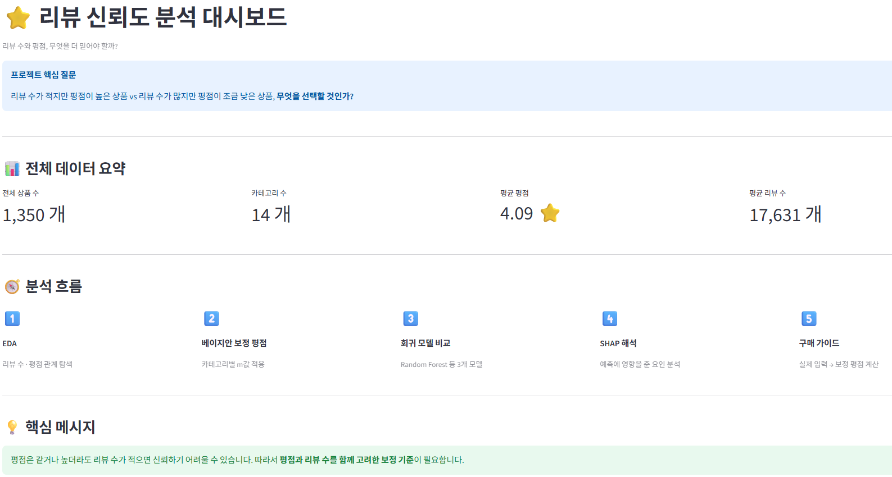
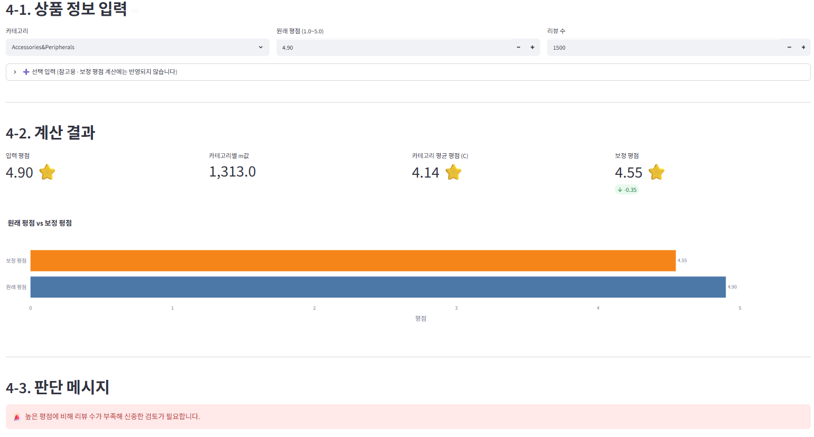

# 리뷰 수를 고려한 Amazon 상품 신뢰도 분석
DACOS team3 (초보3팀) - 26-1학기 토이 프로젝트



## 프로젝트 소개

온라인 쇼핑 시 누구나 겪는 고민, "리뷰 수는 적지만 평점이 높은 상품과 리뷰 수는 많지만 평점이 조금 낮은 상품 중 무엇을 선택해야 하는가"에서 출발한 프로젝트입니다. Amazon Sales Dataset을 활용해 베이지안 평균 기법으로 리뷰 신뢰도를 보정하고, 머신러닝(SHAP)으로 신뢰도에 영향을 미치는 핵심 요인을 분석했습니다.

## 문제 정의

단순 평균 평점은 리뷰 수가 3개인 상품과 3만 개인 상품을 동일하게 취급한다는 한계가 있습니다. 리뷰 수가 적은 상품의 평점은 우연이나 소수 의견에 의해 왜곡될 가능성이 높지만, 기존 쇼핑 플랫폼은 이를 구분 없이 노출합니다. 본 프로젝트는 "리뷰 수를 고려한 보정 평점"을 새로운 지표로 정의하고, 이를 분석·설명하는 모델을 통해 소비자가 더 신뢰할 수 있는 구매 판단 기준을 제시하고자 합니다.

## 사용 데이터

- **출처**: [Kaggle - Amazon Sales Dataset](https://www.kaggle.com/datasets/karkavelrajaj/amazon-sales-dataset)
- **규모**(전처리 후): 상품 1,350개, 카테고리 14종
- **주요 컬럼**: 상품명, 카테고리, 정가/할인가/할인율, 평점, 리뷰 수, 리뷰 텍스트

## 기술 스택

- **언어/라이브러리**: Python, pandas, scikit-learn, XGBoost, SHAP
- **통계 기법**: 베이지안 평균(Bayesian Average) 보정
- **대시보드**: Streamlit, Plotly
- **버전 관리**: Git / GitHub (Conventional Commits 컨벤션 사용)

## 분석 파이프라인

```
Step 1. 데이터 전처리        (A_data_analysis)
Step 2. EDA                  (A_data_analysis)
Step 3. 베이지안 보정 타겟 생성 (A_data_analysis)
Step 4. 피처 엔지니어링       (B_modeling)
Step 4.5. 피처-타겟 병합      (B_modeling)
Step 5. 회귀 모델링           (B_modeling)
Step 6. SHAP 해석             (B_modeling)
Step 7. 대시보드 구현         (C_dashboard)
```

## 프로젝트 구조

```
├── A_data_analysis/       # 전처리, EDA, 베이지안 타겟 생성 (담당: 이민경)
│   ├── step1_preprocess.py
│   ├── step2_eda.py
│   └── step3_bayesian_target.py
│
├── B_modeling/             # 피처엔지니어링, 모델링, SHAP 해석 (담당: 주현정)
│   ├── step4_feature_engineering.py
│   ├── step4.5_merge.py
│   ├── step5_model_pipeline.py
│   └── step6_shap.py
│
├── C_dashboard/            # Streamlit 대시보드 (담당: 최한나)
│   └── streamlit/
│       ├── Home.py
│       └── pages/
│
├── data/
│   ├── raw/                # 원본 데이터
│   └── processed/          # 전처리 및 피처 산출물
├── docs
│   └── images/             # README 첨부 이미지
├── result/                 # 모델 성능, SHAP 결과물
└── README.md
```

## 실행 방법

```bash
# 1. 저장소 클론
git clone https://github.com/user-hjjoo/dacos-team3-toyproject2.git
cd dacos-team3-toyproject2

# 2. 필요 라이브러리 설치
pip install pandas scikit-learn xgboost shap streamlit plotly

# 3. 파이프라인 순서대로 실행 (A_data_analysis -> B_modeling)
python A_data_analysis/step1_preprocess.py
python A_data_analysis/step2_eda.py
python A_data_analysis/step3_bayesian_target.py
python B_modeling/step4_feature_engineering.py
python B_modeling/step4.5_merge.py
python B_modeling/step5_model_pipeline.py
python B_modeling/step6_shap.py

# 4. 대시보드 실행
cd C_dashboard/streamlit
streamlit run Home.py
```

> ※ 각 스크립트 상단의 데이터 경로(`DATA_PATH` 등)는 실행 환경에 맞게 확인이 필요할 수 있습니다.

## 주요 결과

- **모델 성능**: Linear Regression, Random Forest, XGBoost 3개 모델을 비교한 결과 **Random Forest**가 가장 우수한 성능을 보였습니다. 이는 리뷰 수와 보정 평점 사이의 관계가 단순 선형이 아니라는 것을 시사합니다.

- **SHAP 분석**: 보정 평점 예측에 가장 큰 영향을 미치는 요인은 **리뷰 수(log_rating_count)**였으며, 다른 요인들과 뚜렷한 격차를 보였습니다.

- **비선형 패턴 발견**: 리뷰 수가 수백~수천 개 구간을 지날 때 신뢰도가 급격히 상승하는 임계 구간이 확인되었습니다.

- **카테고리별 차이**: 이어폰·헤드폰(Headphones,Earbuds&Accessories) 카테고리는 "적은 리뷰 + 높은 평점" 패턴이 특히 두드러졌습니다.

- **대시보드**: 위 분석 결과를 실제로 체험할 수 있는 인터랙티브 대시보드(EDA 탐색, 모델 인사이트, 구매 가이드 계산기)를 구현했습니다.




## 팀원 및 역할

| 이름 | 역할 |
|---|---|
| 이민경 | 데이터 전처리, EDA, 베이지안 타겟 생성 |
| 주현정 | 피처 엔지니어링, 모델링, SHAP 해석 |
| 최한나 | Streamlit 대시보드 구현 |